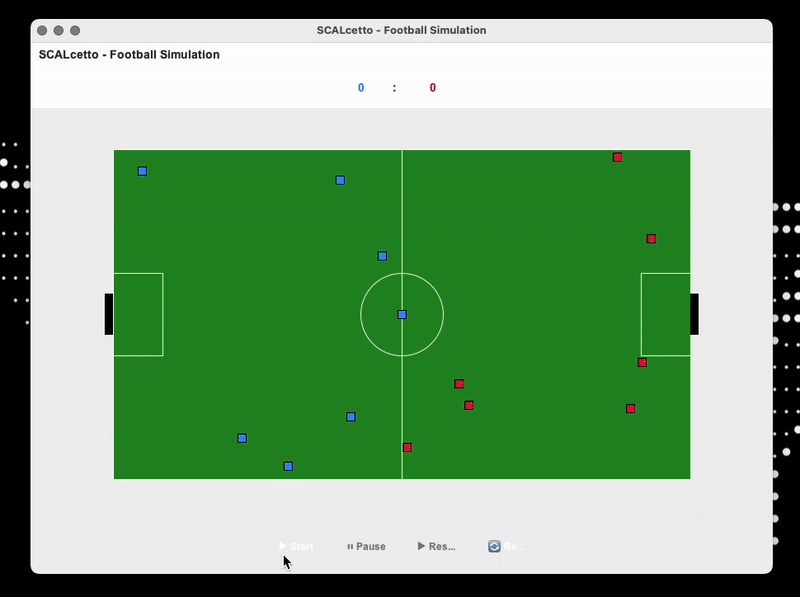

# SCALcetto
SCALcetto is a football match simulator developed in **Scala 3** that implements an intelligent player system.




## BUILD STATUS


## COVERAGE
MAIN [](https://codecov.io/gh/TommasoBrini/PPS-24-SCALcetto)

DEVELOP [](https://codecov.io/gh/TommasoBrini/PPS-24-SCALcetto)

## INFO


# CONTRIBUTE
Once you clone this repo, run in your shell or in the intellij sbt shell
``` bash
sbt setupHooks
```
# BUILD
To build and run the project use sbt
``` bash
sbt compile
sbt run
```
to format automatically the code:
``` bash
sbt scalafmtAll
```
# TEST
if you want run all the tests
``` bash
sbt test
```

# Docs
You can see the live doc pushed in develop directly in the link in the about section. 

You can run locally the docs:
- install jekyll => if you have linux you should have wsl installed
- run the following commands in the shell in the `docs/` directory
``` bash
bundle install
bundle exec jekyll serve
```