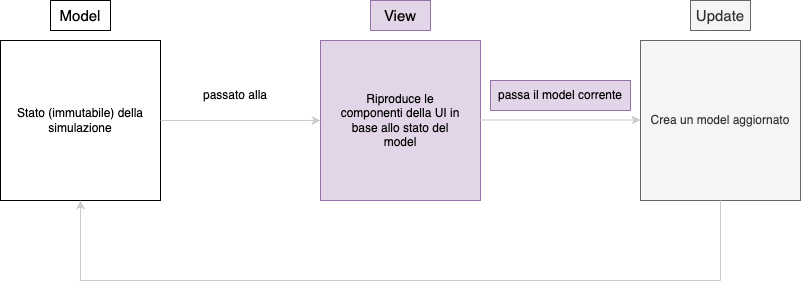

# Design architetturale
Design architetturale (architettura complessiva, descrizione di pattern architetturali usati, eventuali componenti del sistema distribuito, scelte tecnologiche cruciali ai fini architetturali -- corredato da pochi ma efficaci diagrammi)

## MVU
Il pattern Model-View-Update nasce nella comunità del linguaggio Elm come modo naturale di strutturare programmi interattivi, fra cui giochi e web-app.
La sua logica si basa su un flusso di dati unidirezionale e su tre componenti puramente funzionali:
- **Model**: contiene l’unico stato dell’applicazione ed è immutabile.
- **View**: è una funzione pura che riceve il Model e produce la descrizione dell’interfaccia
- **Update**: riceve il Model e un evento, restituendo un nuovo Model; è il cuore della logica e garantisce che le transizioni di stato siano sempre deterministiche

<figure class="w-5 mx-auto">
  
  <figcaption>flusso unidirezionale di MVU</figcaption>
</figure>

### Motivazioni della scelta
Nel nostro simulatore l’adozione di MVU risponde a esigenze precise:

- **Immutabilità e prevedibilità**: Gestire la partita con un singolo stato immutabile rende la simulazione deterministica e quindi più facile da testare e da debuggare.

- **Aderenza alla programmazione funzionale**: Il pattern impone funzioni pure e assenza di mutazione, permettendoci di sfruttare appieno le caratteristiche di Scala e di sperimentare tecniche programmazione funzionale avanzate.

- **Gestione chiara degli eventi di gioco**: Azioni come passaggi, tiri o goal sono modellate come eventi che attraversano l’Update, mantenendo il codice leggibile e centralizzando la logica della simulazione della partita.

### Benefici
L’approccio MVU ci offre:
- Stato unico facilmente serializzabile e versionabile.
- Debug semplificato grazie al flusso dati unidirezionale
- Riduzione degli accoppiamenti fra logica di simulazione e rendering, migliorando la manutenibilità del codice.