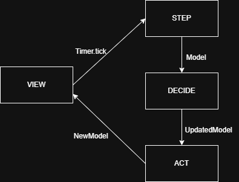

# Design architetturale

// MVU

// DECIDE - VALIDATE - ACT

Design architetturale (architettura complessiva, descrizione di pattern architetturali usati, eventuali componenti del sistema distribuito, scelte tecnologiche cruciali ai fini architetturali -- corredato da pochi ma efficaci diagrammi)

## MVU
Il pattern Model-View-Update nasce nella comunità del linguaggio Elm come modo naturale di strutturare programmi interattivi, fra cui giochi e web-app.
La sua logica si basa su un flusso di dati unidirezionale e su tre componenti puramente funzionali:
- **Model**: contiene l’unico stato dell’applicazione ed è immutabile.
- **View**: è una funzione pura che riceve il Model e produce la descrizione dell’interfaccia
- **Update**: riceve il Model e un evento, restituendo un nuovo Model; è il cuore della logica e garantisce che le transizioni di stato siano sempre deterministiche

<figure class="w-5 mx-auto">
  
  <figcaption>flusso unidirezionale di MVU</figcaption>
</figure>

### Motivazioni della scelta
Nel nostro simulatore l’adozione di MVU risponde a esigenze precise:

- **Immutabilità e prevedibilità**: Gestire la partita con un singolo stato immutabile rende la simulazione deterministica e quindi più facile da testare e da debuggare.

- **Aderenza alla programmazione funzionale**: Il pattern impone funzioni pure e assenza di mutazione, permettendoci di sfruttare appieno le caratteristiche di Scala e di sperimentare tecniche programmazione funzionale avanzate.

- **Gestione chiara degli eventi di gioco**: Azioni come passaggi, tiri o goal sono modellate come eventi che attraversano l’Update, mantenendo il codice leggibile e centralizzando la logica della simulazione della partita.

### Benefici
L’approccio MVU ci offre:
- Stato unico facilmente serializzabile e versionabile.
- Debug semplificato grazie al flusso dati unidirezionale
- Riduzione degli accoppiamenti fra logica di simulazione e rendering, migliorando la manutenibilità del codice.

## Architettura
Per l'architettura interna del simulatore, abbiamo adottato un modello basato su MVU (Model-View-Update), già descritto nel capitolo precedente. In particolare, l'elemento centrale della nostra simulazione è il Model, che rappresenta lo stato completo del mondo simulato, e viene aggiornato a ogni ciclo tramite l'applicazione di un evento.

Nel nostro caso, abbiamo deciso di strutturare la simulazione in fasi sequenziali e funzionalmente pure, ispirandoci a un ciclo di elbaorazione tipico dei sistemi autonomi: **Sense -> Decide -> Act**.
### Fasi della simulazione
<figure class="w-5 mx-auto">
  
  <figcaption>Step-Decide-Act</figcaption>
</figure>

1. **Sense**
Questa fase rappresenta la percezione dell'ambiente da parte di ogni agente (player). E' implementata implicitamente nel *decide*, dove ogni agente ha accesso allo stato globale (cioè all'intero Model) per valutare la posizione della palla, degli altri giocatori e il proprio stato attuale.

2. **Decide**
In questa fase, ogni giocatore valuta la situazione e prende una decisione sul comportamento da adottare. Questo comportamento viene rappresentato da un valore opzionale all'interno del proprio stato che specifica la prossima azione da compiere. Le possibili azioni sono:
- Move: spostamento verso una direzione specifica
- Hit: colpire la palla verso una direzione specifica, con una certa potenza
- Take: entrare in possesso della palla se mi trovo nelle vicinanze

La logica di decisione è specializzata in base allo stato del giocatore:
- Se il giocatore ha la palla, può decidere di passare o tirare (cioè Hit, con una diversa potenza), oppure correre (cioè Move, in una certa direzione)
- Se è un compagno di squadra, // TODO
- Se è in difesa, // TODO

L'output di questa fase è un nuovo modello in cui ogni giocatore ha un'azione da compiere, che verrà applicata nella fase successiva.

3. **Act**
Questa fase applica le azioni decise dai giocatori al modello. Ogni giocatore modifica la propria posizione in base all'azione decisa, e se si tratta di un Hit, la palla viene spostata nella direzione indicata con la potenza specificata. Se per esempio un giocatore decide di prendere la palla, questa viene assegnata a lui. 

La fase di *act* è completamente deterministica, in quanto ogni azione è applicata in modo sequenziale e non ci sono effetti collaterali o mutazioni dello stato al di fuori di questa fase.

### Vantaggi del design
- Separazione chiara delle responsabilità: ogni fase ha una funzione chiara e autonoma, semplificando debug e test.
- Estendibilità: è facile aggiungere nuove logiche decisionali, nuove azioni o comportamenti senza modificare le fase esistenti.
- Purezza funzionale: tutte le trasformazioni sul modello sono pure e immutabili, il che rende il codice predicibile e testabile.

## Integrazione con MVU
Nel ciclo MVU, ogni tick della simulazione, generato dallo *Swing timer* della view, genera a sua volta un evento *Step*, che viene passato alla funzione update(model, event). Questa funzione applica sequenzialmente:
- decide(state) -> aggiorna lo stato dei giocatori con le loro decisioni sulla prossima azione.
- act(state) -> applica le azioni decise dai giocatori al modello, modificando la posizione della palla e dei giocatori.

Il risultato di questa catena di update sarà un nuovo model, che verrà renderizzato dalla **View**, in modo del tutto indipendente dalla logica del gioco.

Questa architettura ci ha permesso di modellare una simulazione realistica, modulare e facilmente scalabile, mantenendo alta la coerenza con i principi della programmazione funzionale.