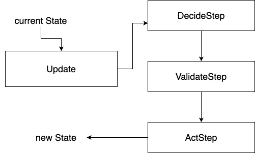

# Design architetturale

## MVU

Il pattern Model-View-Update (MVU) nasce nella comunità del linguaggio Elm come modo naturale di strutturare programmi interattivi. La sua logica si basa su un flusso di dati unidirezionale e su tre componenti puramente funzionali:

- **Model**: contiene l’unico stato dell’applicazione ed è immutabile, rappresentando entità come giocatori, palla e punteggio in una struttura dati come `Match` che raggruppa team, palla e punteggio senza mutazioni dirette.
- **View**: è una funzione pura che riceve il Model e produce la descrizione dell’interfaccia, gestendo il rendering del campo, dei giocatori e degli elementi grafici tramite componenti Swing in Scala, con pannelli dedicati per la visualizzazione e i controlli utente.
- **Update**: riceve il Model e un evento, restituendo un nuovo Model; è il cuore della logica e garantisce che le transizioni di stato siano sempre deterministiche, elaborando eventi come rimbalzi della palla o goal attraverso un flusso sequenziale.

<figure class="w-5 mx-auto">
  
  <figcaption>flusso unidirezionale di MVU</figcaption>
</figure>

### Architettura MVU per la gestione generale della simulazione

L'architettura MVU è adottata per la gestione generale della simulazione di una partita di calcio, sfruttando l'immutabilità dello stato per garantire prevedibilità e facilità di testing. 
Nel simulatore, il Model cattura lo stato completo della partita, inclusi posizioni e movimento di giocatori e palla, definiti con algebra spaziale per posizioni, direzione e velocità. 
La View si occupa del rendering grafico, disegnando elementi come il campo, i goal e i giocatori con colori distinti per le squadre, integrando pannelli informativi per il punteggio e controlli interattivi come pulsanti per start, pause e reset. 
L'Update orchestra le transizioni, elaborando eventi di gioco in modo funzionale per mantenere la simulazione deterministica e scalabile.

## Gestione dell'update di MVU

La gestione dell'Update in MVU è strutturata in un'architettura a step, dove ogni step modifica lo stato creando una nuova istanza del Model, preservando l'immutabilità. Questo approccio si basa su un flusso di elaborazione che parte dal Model corrente, applica trasformazioni basate su eventi e produce un nuovo stato, come visibile nel codice che esegue sequenzialmente decide, validate e act per aggiornare la partita. Ogni step è concepito come un istante di simulazione, in cui azioni come movimenti o interazioni con la palla vengono processate in modo atomico, garantendo che lo stato rimanga consistente e versionabile senza effetti collaterali.

### 3 layer fondamentali
- **Decide**: Questo layer gestisce le decisioni dei giocatori, modellando intenzioni come `Run`, `Pass`, `Shoot` o `Tackle` basate su logiche di gioco, assegnando azioni a ciascun giocatore in base al contesto della partita e alle loro posizioni sul campo.
- **Validate**: Qui, le decisioni vengono valutate contro rating specifici (ad esempio, probabilità di successo basate su posizione, velocità e interazioni), trasformandole in azioni concrete solo se valide, prevenendo stati inconsistenti e integrando logiche come la validazione di movimenti o intercettazioni.
- **Act**: Il layer finale esegue l'azione, aggiornando posizioni e movimento di entità come giocatori e palla, creando un nuovo stato immutabile; ad esempio, gestendo rimbalzi o goal con funzioni che restituiscono copie modificate del Model, mantenendo l'assenza di mutazioni dirette.
<figure class="w-5 mx-auto">
  
  <figcaption>flusso unidirezionale dell'update</figcaption>
</figure>

## Motivazioni della scelta
Nel nostro simulatore l’adozione di MVU risponde a esigenze precise:
- **Immutabilità e prevedibilità**: Gestire la partita con un singolo stato immutabile rende la simulazione deterministica e quindi più facile da testare e da debuggare, come dimostrato dall'uso di strutture dati opache per posizione e movimento che evitano modifiche in-place.
- **Aderenza alla programmazione funzionale**: Il pattern impone funzioni pure e assenza di mutazione, permettendoci di sfruttare appieno le caratteristiche di Scala e di sperimentare tecniche avanzate, inclusa l'algebra spaziale per calcoli geometrici e costruzione di dsl.
- **Gestione chiara degli eventi di gioco**: Azioni come passaggi, tiri o goal sono modellate come eventi che attraversano l’Update, mantenendo il codice leggibile e centralizzando la logica della simulazione della partita, con handling esplicito di eventi come goal che triggerano reset del campo.

## Benefici

L’approccio MVU ci offre:

- Stato unico facilmente serializzabile e versionabile, ideale per snapshot della simulazione.
- Debug semplificato grazie al flusso dati unidirezionale e all'immutabilità, che riduce errori di stato condiviso.
- Riduzione degli accoppiamenti fra logica di simulazione e rendering, migliorando la manutenibilità del codice, con separazione chiara tra update funzionale e view grafica.