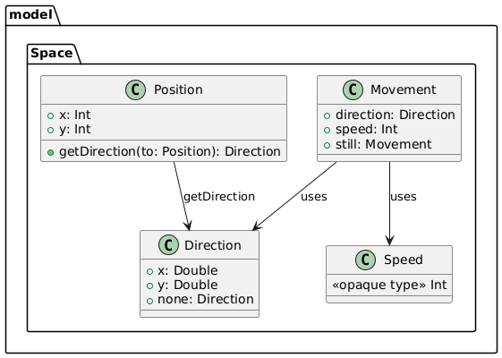

# Design di dettaglio
Design di dettaglio (scelte rilevanti di design, pattern di progettazione, principi clean code, organizzazione del codice, Descrizione Model (Match, Space) -- corredato da pochi ma efficaci diagrammi)

## Space
Siamo partiti modellando la rappresentazione dello spazio attraverso 3 tipi: Position, Direction e Movement
<figure class="w-5 mx-auto">
  
  <figcaption>Space</figcaption>
</figure>

Ogni entità di gioco ha al suo interno la posizione e il movimento: è stato quindi pensato di generalizzarli
in due trait Entity e Moving. Ecco la loro architettura:

## Behaviour
Inizialmente pensavamo fosse sufficiente gestire il comportamento del giocatore attraverso un insieme di azioni,
ma si è poi resa necessaria la rappresentazione dell'intenzione di un giocatore attraverso quella che abbiamo chiamato
decisione.
Per esempio l'intenzione di intercettare la palla oppure di effettuare un tackle al portatore si concludono entrambe con 
l'azione di conquista della palla, ma hanno diversi effetti sullo stato della partita.
Si sono così venute a delineare le 3 diverse fasi già citate ovvero *Decide*, *Validate* e *Act*, in cui vengono prese
le decisioni, convertite in azioni di successo o insuccesso e poi applicate allo stato della partita.
