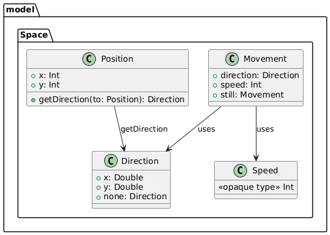
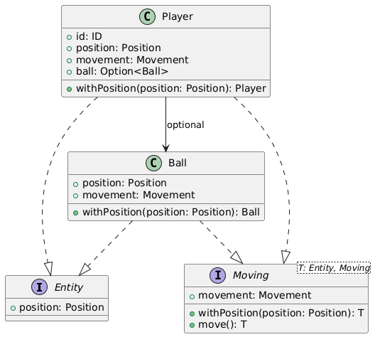
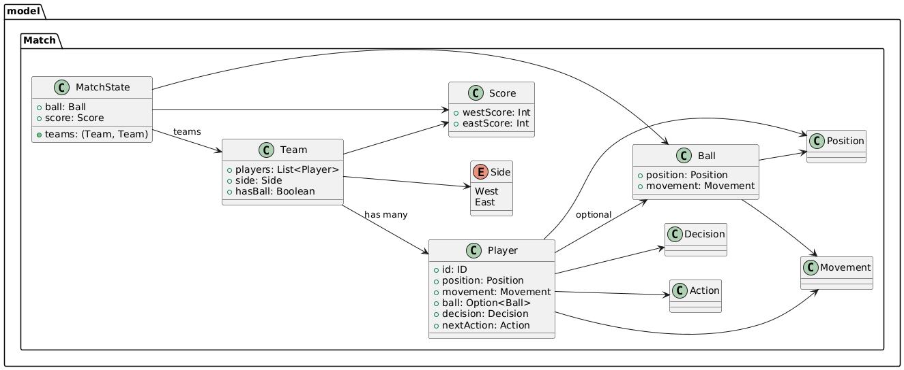
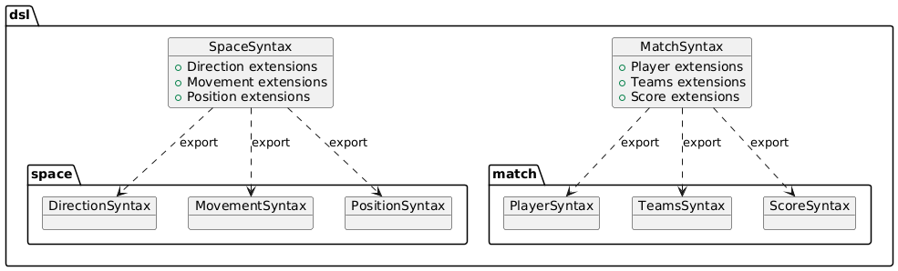

# Design di dettaglio
Design di dettaglio (scelte rilevanti di design, pattern di progettazione, principi clean code, organizzazione del codice, Descrizione Model (Match, Space) -- corredato da pochi ma efficaci diagrammi)

## Model
Abbiamo cominciato il progetto modellando quello che è uno dei concetti fondamentali, ovvero la rappresentazione spaziale.
### Space
In questa sezione, che di fatto è un `object` si è modellata la rappresentazione dello spazio attraverso 3 tipi fondamentali:
- `Position`: coppia di interi rappresentante la posizione.
- `Direction`: coppia di interi rappresentante l'offset da applicare a *Position* per modificarla.
- `Movement`: composto da *Direction* e da un intero che rappresenta la velocità.
<figure class="w-5 mx-auto">
  
  <figcaption>Space representation</figcaption>
</figure>

### Entities

Ogni entità di gioco ha al suo interno la posizione e il movimento: è stato quindi pensato di generalizzarli
in due trait `Entity` e `Moving`. Ecco la loro architettura:
<figure class="w-5 mx-auto">
  
  <figcaption>Entity hierarchy</figcaption>
</figure>

Nel caso di `Moving` il metodo *move* è già implementato e sfrutta *withPosition* come
costruttore della sottoclasse passandogli *(position + movement)*. E' così sufficiente
implementare nelle sottoclassi *withPosition*.

### Behaviour

Un altro aspetto distintivo del progetto riguarda la **modellazione del comportamento dei giocatori**.
In una prima fase si ipotizzava che fosse sufficiente rappresentare il comportamento dei `Player` direttamente 
attraverso un insieme di `Action`. Tuttavia, nel corso dello sviluppo è emersa la necessità di introdurre un livello 
concettuale intermedio che catturasse l’**intenzione** del giocatore, indipendentemente dal suo esito effettivo.  
Questa intenzione viene rappresentata dal tipo `Decision`.

Ad esempio, sia l’intercettazione della palla che il tackle al portatore si concretizzano – in caso di successo – 
nell’**azione di conquista della palla**. 
Tuttavia, le due intenzioni hanno significati tattici ed effetti differenti sullo stato della partita.
Da qui, la scelta di introdurre una distinzione netta tra **Decision** e **Action**:
- **`Decision`**: rappresenta l’intenzione del giocatore, ad alto livello.  
  Può avere esito positivo o negativo, e viene successivamente trasformata in una `Action`.
- **`Action`**: rappresenta il comportamento concreto da eseguire sul campo, e produce effetti osservabili sullo 
stato della simulazione (movimenti, tiri, ecc.).

Questa separazione tra intenzione e azione consente una gestione più espressiva, flessibile e testabile della logica di gioco, favorendo al tempo stesso l’applicazione di strategie differenti a parità di effetti osservabili.

Si sono qui poi venute a delineare le 3 diverse fasi già citate ovvero **Decide**, **Validate** e **Act**, 
di cui parleremo in seguito, dove vengono prese le decisioni, convertite in azioni di successo o insuccesso 
e poi applicate allo stato della partita.

### Match
Il modello è stato successivamente strutturato raggruppando i `Player` all'interno di `Team`, ciascuno dei quali è 
caratterizzato dal lato del campo difeso (`Side`) e da un flag che indica se la squadra è attualmente in possesso della palla.

L'introduzione del flag `hasBall` si è resa necessaria in quanto l’uso di `Option[Ball]` all’interno del singolo `Player` 
non era sufficiente a rappresentare correttamente alcune situazioni intermedie, come ad esempio durante un passaggio: 
in questi casi, nessun giocatore detiene direttamente la palla, ma il possesso è comunque attribuibile a una delle due squadre.

La gestione esplicita del possesso di squadra è fondamentale per la fase di **Decide**, poiché consente di distinguere 
i comportamenti e le strategie da adottare in base allo stato attuale del gioco.

Ecco il diagramma risultante:
<figure class="w-1/3 mx-auto">
  
  <figcaption>Model<figcaption>
</figure>

## DSL
Da questo stato del model sono poi state sviluppate delle sintassi che permettessero agilmente di interagire con i
vari componenti:
- `CreationSyntax`: definita per creare stati del match, come quello di calcio d'inizio.
- `SpaceSyntax` e `MatchSyntax`: definite per manipolare comodamente il modello.
- `package decision`: definito per gestire il comportamento di decisione dei giocatori e le regole di validazione.
- `ActionProcessor`: definito per manipolare lo stato processando le  azioni dei giocatori.

### Space e Match syntax
Le sintassi per spazio e match sono stati organizzati in due object `SpaceSyntax` e `MatchSyntax` che a loro volta 
fanno `export` e quindi si compongono rispettivamete di `PositionSyntax`, `DirectionSyntax` e `MovementSyntax`
per lo spazio e `PlayerSyntax`, `TeamsSyntax` e `ScoreSyntax` per il match.
<figure class="w-5 mx-auto">
  
  <figcaption>Space and match syntax<figcaption>
</figure>

Gli altri tipi di sintassi verranno affrontati nelle implementazioni.

## Update
A questo punto è giusto analizzare più nel dettaglio il design del ciclo di `Update`.

### Decide
La fase **Decide** costituisce il primo stadio del ciclo di simulazione, in cui ogni giocatore valuta il contesto 
attuale della partita per formulare un’intenzione, rappresentata da una `Decision`.  
L’implementazione di questa logica è centralizzata nel modulo `update.decide.Decide`, che funge da orchestratore dell’intero processo decisionale.
Essa si suddivide nelle seguenti fasi:

1. **Assegnazione dei ruoli**  
   Ogni `Player` riceve un ruolo tattico coerente con lo stato della partita:
    - `BallCarrier` se ha il possesso
    - `Teammate` se appartiene alla squadra in possesso
    - `Opponent` altrimenti  
      Il metodo `assignRoles` effettua questa mappatura internamente.

2. **Determinazione dei ruoli di squadra**  
   Viene identificata la squadra in possesso palla, distinguendo tra offensiva e difensiva.  
   Questa distinzione guida la strategia adottata nella fase successiva.

3. **Assegnazione delle marcature**  
   I giocatori difensivi vengono associati ad avversari offensivi da marcare tramite `Util.assignMarkings`.

4. **Calcolo della decisione individuale**  
   Ogni giocatore elabora una `Decision` basata sul contesto (`MatchState`) e sulle marcature ricevute.  
   Il calcolo è delegato all’extension method `player.decide(state, markings)` definito nel DSL, che può restituire decisioni come `Run`, `Pass`, `Shoot`, `Tackle`, ecc.

### Validate

La fase **Validate** rappresenta il secondo stadio del ciclo di simulazione.  
Qui, le `Decision` assegnate a ciascun `Player` vengono valutate e tradotte in azioni concrete (`Action`) sulla base
del contesto della partita.

L’obiettivo principale è determinare quali decisioni possono essere effettivamente eseguite e con quale esito
(successo o fallimento).

Ogni giocatore possiede una `Decision`, calcolata nella fase precedente (`Decide`).  
Ora, per ciascuna decisione si valutano **le probabilità di successo** associate a quell’azione
e si assegna al `Player` una `nextAction` coerente con la decisione iniziale, scegliendo tra due rami:

- **Successo** → ad esempio: `Hit`, `Take`, `Move`
- **Fallimento** → fallback come: `Stopped`, o `Hit` con direzione variata

Ogni tipo di `Decision` ha un proprio comportamento di fallback definito via `onFailure`, che consente di gestire anche i casi negativi in modo dichiarativo e controllato.

Alla fine della fase `Validate`, ogni `Player` ha una `nextAction` assegnata e pronta per essere eseguita nella fase successiva (`Act`).

### Act

La fase **Act** costituisce lo stadio finale del ciclo di simulazione.  
Qui, le `Action` precedentemente validate vengono **effettivamente eseguite**, applicando modifiche al `MatchState`.

È in questa fase che le entità – come giocatori e palla – vengono **mosse sul campo**, e che eventuali effetti globali 
come goal o uscite laterali vengono rilevati. Verranno poi elaborati alla fine del ciclo di **Update**.

Ogni `Player`, all'ingresso in fase di **Act** ha il campo `nextAction` valorizzato. Questo avviene appunto durante
la fase di `Validate`.  

Oltre all’esecuzione individuale delle `Action`, vengono applicati anche gli effetti collaterali delle azioni.
Per esempio il `Tackle`, se eseguito con successo, toglie palla al portatore e setta la sua azione a `Stopped`.

Al termine della fase di `Act`, viene ritornato un **nuovo `MatchState` aggiornato** e un evento opzionale
che può essere avvenuto durante la fase.

## Riflessioni sul design
Il design adottato per la simulazione si fonda su una struttura modulare, espressiva e funzionale, in cui ogni 
componente del modello è stato progettato per essere facilmente componibile e riusabile.

L’introduzione di concetti come `Decision` e `Action`, unita alla separazione in fasi distinte 
(`Decide`, `Validate`, `Act`), ha permesso di costruire un ciclo di aggiornamento chiaro, estensibile e testabile.  
In particolare, la distinzione tra intenzione e azione ha favorito una modellazione realistica del comportamento
dei giocatori e una maggiore flessibilità nella gestione delle strategie di gioco.

L’uso di DSL dedicate e di una sintassi funzionale ha reso il codice conciso e leggibile, facilitando l’interazione con il modello e riducendo la complessità nel controllo dello stato della simulazione.

Complessivamente, il progetto offre una base solida su cui innestare ulteriori funzionalità (come strategie più complesse, moduli di IA o visualizzazioni) mantenendo una separazione netta tra logica, stato e interazione.  
Il design dettagliato qui presentato dimostra come una progettazione accurata dei modelli e del ciclo di simulazione possa portare a un sistema robusto, chiaro e facilmente estendibile.
