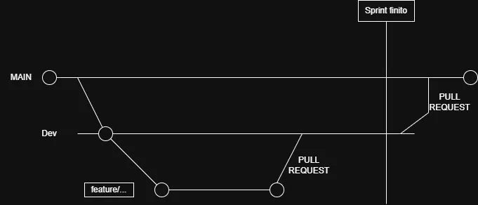

# Processo di Sviluppo 
In questo capitolo viene descritta la metodologia di sviluppo adottata, il sistema di versioning con le relative convenzioni e le pipeline di CI/CD implementate
## Metodologia
Come tecnica di sviluppo del nostro software, abbiamo scelto di adottare un approccio Agile, in particolare seguendo la metodologia Scrum. 
Questo approccio ci consente di essere flessibili e reattivi ai cambiamenti, migliorando continuamente il nostro prodotto attraverso iterazioni brevi e feedback costanti, 
in modo da organizzare in maniera iterativa e incrementale lo sviluppo del simulatore.

Inizialmente, abbiamo fissato alcuni meeting per sincronizzare il team, definendo in maniera ottimale il dominio e la parte di setup del progetto. Una volta elaborata e sottomessa la proposta di progetto,
abbiamo regolato durata e frequenza dei meeting in base alle esigenze del team, stabilendo un incontro settimanale per discutere i progressi e pianificare le attività future.

Il lavoro è stato infatti suddiviso in sprint settimanali, ognuno caratterizzato da:
- Sprint Planning: pianificazione degli obiettivi da raggiungere durante la durata dello sprint.
- Daily Scrum: brevi incontri giornalieri di 10-15 minuti per allineare il team su problemi, avanzamento e passi successivi.
- Sprint Review: incontro finale dello sprint per valutare le funzionalità implementate, produrre una nuova release del progetto, riflette su cosa ha funzionato e su come migliorare nel successivo sprint.

In questo modo abbiamo potuto adattare i requisiti in corso d'opera, correggere tempestivamente le criticità e consegnare demo funzionanti a cadenza regolare.

### Ruoli
- **Product Owner**: Brini Tommaso. Responsabile della definizione dei requisiti, prioritizzazione del backlog e comunicazione con gli stakeholder, garantisce che il team lavori sulle feature di maggior valore per il progetto.
- **Scrum Master**: Samite Mounir. Responsabile della verifica della corretta applicazione della metodologia Scrum, occupandosi di rimuovere gli imprevisti, supportando il team nell'adozione della metodologia e promuovendo il miglioramento continuo.
- **Stakeholder**: Rattini Emiliano. Responsabile della qualità e committente dei requisiti del prodotto.
- **Team di Sviluppo**: Brini Tommaso, Samite Mounir, Rattini Emiliano. Sviluppatori che collaborano per implementare le funzionalità del prodotto.

### YouTrack
Per tracciare tutte le attività di sviluppo abbiamo utilizzato YouTrack come strumento di project management:
- Creazione dei task -> ogni nuova funzionalità, bug o attività di refactoring è stata modellata come issue, con descrizione dettagliata e stima dei tempi.
- Backlog -> abbiamo mantenuto un backlog ordinato e agiornato: durante lo Sprint Planning abbiamo selezionato i task più urgenti, spostandoli al successivo sprint, mentre le richieste meno prioritarie rimanevano per sprint futuri.
- Timesheet -> abbiamo registrato il tempo impiegato per ogni task, consentendo una stima più accurata delle risorse necessarie per completare le attività future.

## Controllo di Versione
Durante lo sviluppo del progetto abbiamo utilizzato Git come sistema di controllo di versione distribuito (DVCS), abbinato a GitHub come piattaforma di hosting del codice sorgente.
Git ci ha permesso di lavorare in parallelo in modo efficiente, gestendo con semplicità ramificazioni, merge e cronologie delle modifiche. Github ha offerto un'infrastruttura affidabile per l'integrazione continua, tracciamento delle pull request e la revisione del codice tra membri del team.

### Convenzioni sui commit
Abbiamo adottato la convenzione Conventional Commits, un formato standard per i messaggi di commit che rende la cronologia leggibile e consente l'automazione delle release.
Grazie a questa convenzione, il sistema di rilascio automatico è stato in grado id determinare se creare una release e con quale versione, in base ai tipi di commit effettuati.

### Workflow
Abbiamo seguito un flusso di sviluppo simile a GitFlow, ma semplificato e adattato al nostro processo Scrum:
- **Branch main**: rappresenta la versione stabile del progetto. Viene aggiornata solo alla fine di ogni sprint, con una release consolidata.
- **Branch develop**: contiene lo stato intermedio dell'implementazione. Tutte le nuove funzionalità vengono integrate qui prima della stabilizzazione.
- **Feature branches**: per ogni nuova funzionalità, viene creata una branch dedicata a partire da develop. Una volta completata, viene aperta una pull request per la revisione e l'integrazione in develop.
- **Release**: Al termine di ogni sprint, viene aperta una pull request da develop a main, e viene generata automaticamente una release GitHub con un numero di versione incrementato e con l'aggiornamento del badge nel README.

<figure class="w-5 mx-auto">
  
  <figcaption>Workflow</figcaption>
</figure>

## CI/CD
Per garantire la qualità del codice e l'automazione del processo di rilascio, abbiamo implementato una pipeline di Continuous Integration/Continuous Deployment (CI/CD) utilizzando GitHub Actions.
La pipeline è stata configurata per eseguire automaticamente i seguenti passaggi ad ogni push o pull request:
1. **Build**: Compilazione del progetto per verificare che non ci siano errori di sintassi o di configurazione.
2. **Test**: Esecuzione dei test unitari e di integrazione per garantire che le funzionalità implementate funzionino correttamente.
3. **Formatting**: Verifica della formattazione del codice secondo le convenzioni stabilite, utilizzando strumenti come **Scalafmt**.
4. **Coverage**: Generazione del report di copertura del codice per monitorare la qualità dei test e identificare le aree non coperte, utilizzando strumenti come **CodeCov**.
5. **Release**: Solamente per push e pull request su main, se tutti i passaggi precedenti hanno successo, viene generata automaticamente una nuova release su GitHub, con aggiornamento del numero di versione e del badge nel README.

Per garantire la qualità del codice e la conformità del versionamento, abbiamo definito anche alcuni hooks pre-commit:
- **Pre-commit**: Controlla automaticamente la formattazione prima di ogni commit, utilizzando strumenti come **Scalafmt**.
- **Commit-msg**: Controlla che i messaggi di commit seguano le convenzioni stabilite, in modo da mantenere una cronologia chiara e leggibile.

Questo approccio ci ha permesso di mantenere un flusso di lavoro ordinato, tracciabile e automatizzato, riducendo al minimo gli errori manuali e aumentando la qualità del ciclo di sviluppo.

## Testing
Durante lo sviluppo del progetto abbiamo adottato un approccio al Test-Driven Development (TDD), con l'obiettivo di garantire fin da subito un codice affidabile, ben progettato e facilmente estendibile.

TDD è una metodologia che prevede di scrivere i test prima dell'implementazione del codice vero e proprio. Ogni nuova funzionalità è stata sviluppata seguendo il ciclo:
1. **Red** – scrivere un test che fallisce, definendo il comportamento atteso
2. **Green** – implementare il codice minimo necessario per farlo passare
3. **Refactor** – migliorare il codice mantenendo i test verdi

Questo approccio ci ha permesso di guidare la progettazione delle API in modo chiaro e mirato, scrivendo solo il codice strettamente necessario.

Per la scrittura e l'esecuzione dei test abbiamo utilizzato il framework **ScalaTest**, che offre un'ampia gamma di funzionalità per testare applicazioni Scala.
Abbiamo utilizzato anche **scoverage**, strumento di Codecov che ci ha permesso di generare report di copertura del codice, monitorando le aree coperte dai test e identificando quelle da migliorare.

Il livello di copertura è stato mantenuto costantemente elevato, grazie anche alla visibilità dei badge di coverage nel README che incentivano la scrittura sistematica dei test.

L’approccio TDD, unito all’automazione e alla copertura continua, ci ha permesso di affrontare con sicurezza lo sviluppo incrementale, rendendo il codice robusto e facilmente estendibile nel tempo.